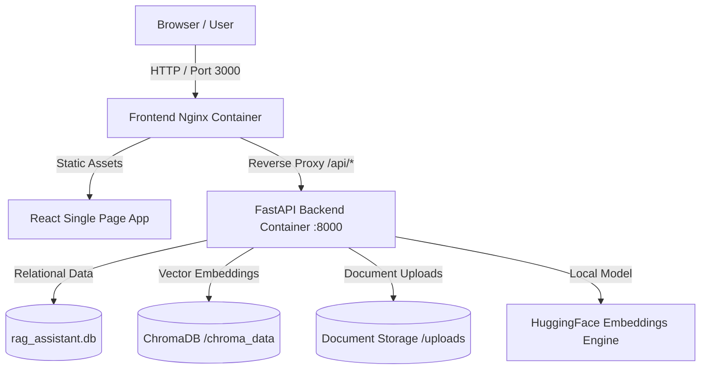

# Enterprise RAG Knowledge Assistant - Production Deployment Guide

This guide details how to build, deploy, and run the **Enterprise RAG Knowledge Assistant** in production environments using **Docker Compose**, **AWS/GCP Container Platforms**, or Cloud PaaS providers like **Render** and **Railway**.

---

## 🚀 Quick Deployment with Docker Compose (Recommended)

### Prerequisites
- [Docker Engine](https://docs.docker.com/get-docker/) (20.10+)
- [Docker Compose](https://docs.docker.com/compose/install/) (v2+)

### Step 1: Environment Configuration
Create or update your `.env` file in the root directory:

```env
# Server
PORT=8000
HOST=0.0.0.0
ENV=production

# Database & Vector Store
DATABASE_URL=sqlite:////app/rag_assistant.db
CHROMA_DB_DIR=/app/chroma_data
UPLOAD_DIR=/app/uploads

# Security
JWT_SECRET=production_secure_jwt_secret_key_change_me_998877

# AI Models (sentence-transformers | openai | gemini)
EMBEDDING_PROVIDER=sentence-transformers
LLM_PROVIDER=mock

# Optional External API Keys
OPENAI_API_KEY=
GEMINI_API_KEY=
```

### Step 2: Build and Start Containers
Run the following command in the project root:

```bash
docker-compose up --build -d
```

### Step 3: Verify Deployment Health
Check that both containers are running and healthy:

```bash
docker-compose ps
```

Expected output:
- `rag_backend`: Running & Healthy on `http://localhost:8000` (`/health` endpoint `200 OK`)
- `rag_frontend`: Running on `http://localhost:3000` (Nginx reverse-proxying `/api` requests to backend)

---

## 🌐 Production Architecture Overview



---

## ☁️ Cloud PaaS Deployment (Render / Railway / Fly.io)

### Backend Service (Python FastAPI)
1. **Build Command**: `pip install -r backend/requirements.txt`
2. **Start Command**: `uvicorn backend.app.main:app --host 0.0.0.0 --port 8000`
3. **Environment Variables**:
   - `DATABASE_URL`: `sqlite:///./rag_assistant.db`
   - `CHROMA_DB_DIR`: `./chroma_data`
   - `UPLOAD_DIR`: `./uploads`
   - `JWT_SECRET`: `<your_production_secret>`

### Frontend Service (React Vite)
1. **Build Command**: `cd frontend && npm install && npm run build`
2. **Publish Directory**: `frontend/dist`
3. **Rewrite Rule**: Map `/api/*` to `https://your-backend-url.com/*`.

---

## 🛠️ Automated Verification & Health Checks

Verify your deployment pipeline anytime by running:

```bash
# Automated pipeline test script
python backend/tests/verify_pipeline.py
```

---

## 🔒 Security Best Practices for Production

1. **JWT Secret**: Always update `JWT_SECRET` in `.env` to a cryptographically secure random string before deploying publicly.
2. **CORS Configuration**: In `backend/app/main.py`, restrict `allow_origins` from `["*"]` to your exact production domain.
3. **SSL/TLS**: Enable HTTPS using Let's Encrypt / Certbot or cloud provider SSL termination.
